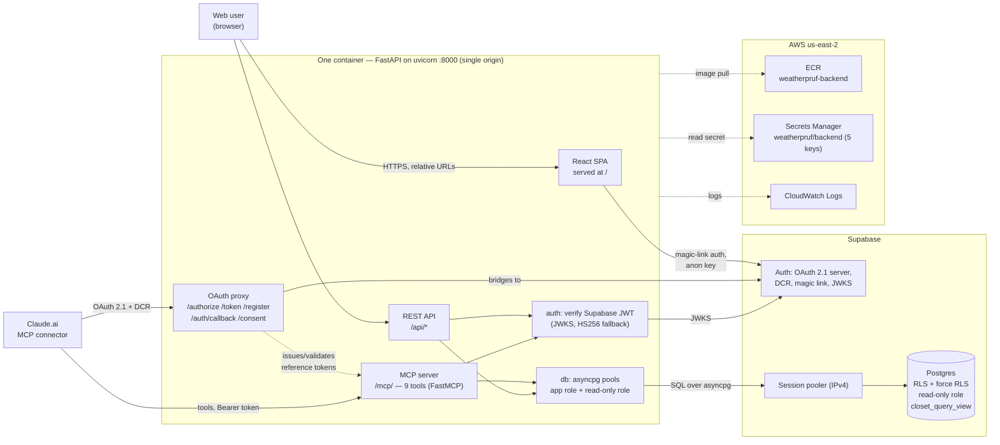
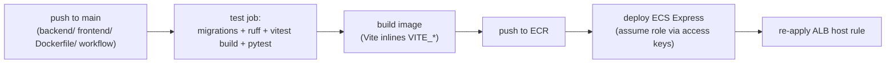

# System architecture

weatherpruf is a digital closet you fill in once and then let an assistant dress
you from, using the weather. It ships as **one container** that is the whole
product — web app, REST API, and MCP connector on one origin — deployed to **ECS
Express Mode** in `us-east-2`, backed by **Supabase** (Postgres + Auth), and
delivered by **GitHub Actions**. For the networking specifics (ALB, TLS, the
IPv6/pooler decision) see [`networking.md`](./networking.md); for the deploy
runbook see [`../infra/README.md`](../infra/README.md).

## The whole system

## Components

**Frontend (React + Vite).** The SPA at `/`: magic-link sign-in, the closet
(browse/add/correct items), a settings page, the "Connect your assistant" page,
and the OAuth **consent screen** Supabase redirects to. It talks only to this
app's `/api` (relative URLs) and to Supabase Auth for the magic link. Build-time
`VITE_*` values (Supabase URL + anon key) are inlined into the bundle — public by
design; RLS protects the data.

**Backend (FastAPI, one process).**
- **`/api`** — the REST API the web app uses.
- **`/mcp/`** — the FastMCP server exposing the assistant's tools; the transport
  is served at both `/mcp` and `/mcp/`.
- **OAuth proxy** — serves the OAuth endpoints at this origin and bridges them to
  Supabase so Claude's connector can register and sign in (see the runbook).
- **auth** — one verifier for both surfaces: a Supabase JWT is checked against
  the project JWKS (HS256 fallback for local dev), resolving one `user_id` that
  RLS keys off.
- **db** — two asyncpg pools: the application role, and a separate **read-only**
  role that is the real security boundary behind the closet-query tool.
- **static** — serves the built SPA and falls back to `index.html` for client
  routes, while `/api/*` and unknown `/.well-known/*` return JSON.

**Supabase.** Postgres with **RLS** (and `force row level security`) on the
user-data tables, a dedicated read-only role, and `closet_query_view`; plus Auth
as the **OAuth 2.1 authorization server** (Dynamic Client Registration, magic
link, JWKS). Reached over the **Session pooler** for IPv4.

**AWS.** ECR (image), Secrets Manager (the five runtime secret keys), CloudWatch
(logs), and the ECS Express Mode service + ALB (see networking). Access is via
scoped IAM roles; the CI deploy uses an access-key user that can only assume the
deploy role (GitHub OIDC is denied by the managed-IAM SCP — see the runbook's
"Redos").

## Two request paths

**Web user:** browser → ALB → container `/` (SPA) and `/api` (REST). Auth is a
browser-held Supabase JWT (magic link); every `/api` and tool call re-resolves it
and runs under RLS.

**Assistant (Claude):** the connector discovers OAuth at the app origin → DCR →
OAuth 2.1 (auth-code + PKCE) proxied to Supabase → user approves on the proxy and
Supabase consent screens → Claude receives a reference token → each `/mcp/` call
swaps it for the stored Supabase token, re-validated by the same verifier, then
runs a tool under the same RLS.

## CI/CD

Pushes to `main` touching `backend/`, `frontend/`, `infra/Dockerfile`, or the
workflow run tests, then build → push → deploy. The service runs a **single
task** for v1 because the OAuth proxy's token store is per-instance; connectors
re-authorize once after each deploy.
