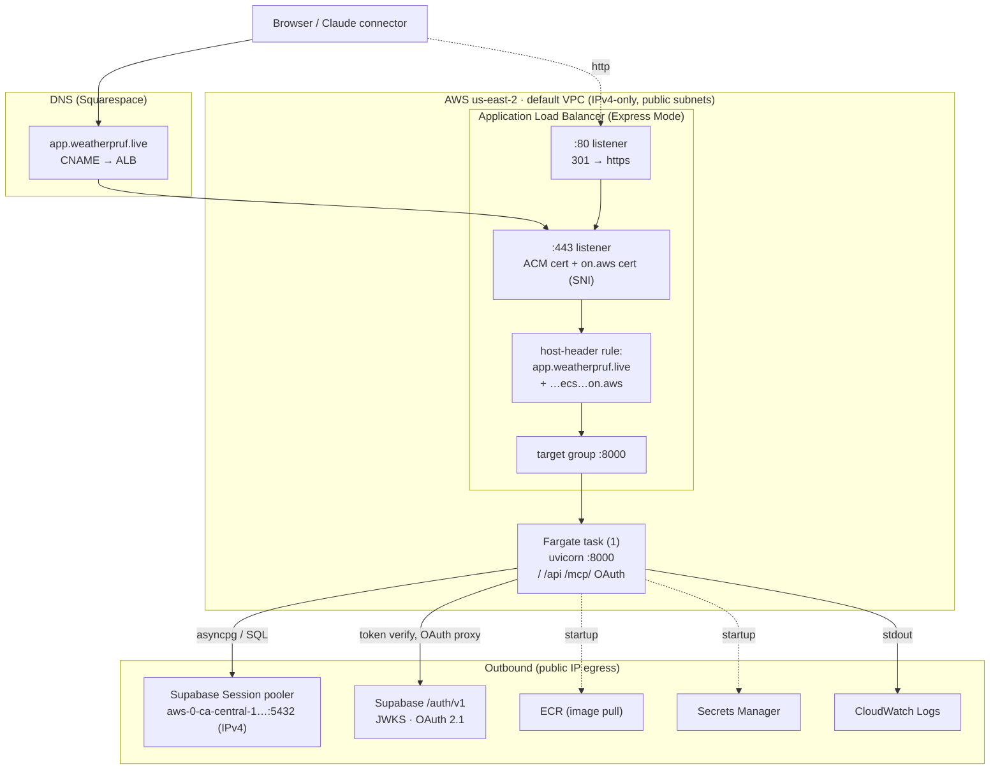

# Networking

How a request reaches weatherpruf, how the one container talks to the outside
world, and the networking decisions that shaped the stack. Everything lives in
**one AWS Region, `us-east-2`**, behind **one ALB**, in **one container**.

## The path of a request

## One origin, no CORS, no CDN

The container serves the React bundle at `/`, the REST API at `/api`, and the
MCP connector at `/mcp/` (and the OAuth endpoints — see below) from the **same
origin**. That is the single biggest networking decision: it removes CORS, a
second TLS certificate, a second domain, and a separate static-hosting
distribution. The frontend uses **relative URLs**, so no cross-origin request is
ever made; `CORS_ALLOW_ORIGINS` is empty and `VITE_API_BASE_URL` is unset. At
single-digit concurrent users a CDN in front of the static assets would buy
nothing to pay for that.

## The load balancer (ECS Express Mode)

Express Mode created and manages an internet-facing ALB. Two hostnames resolve
to it and both are served:

- **`app.weatherpruf.live`** — a Squarespace **CNAME** to the ALB's DNS name
  (`ecs-express-gateway-alb-…elb.amazonaws.com`). DNS is on Squarespace, so this
  is a CNAME, not a Route 53 alias.
- **`…ecs.us-east-2.on.aws`** — the URL Express Mode generated, still valid.

Listeners:

- **`:443`** carries **two certificates** selected by **SNI** — the ECS-managed
  cert for the `on.aws` host and our **ACM** cert for `app.weatherpruf.live`
  (DNS-validated, auto-renewing; its validation CNAME must stay in DNS forever).
- **`:80`** is a plain **301 redirect** to HTTPS.
- A **host-header rule** forwards **both** hostnames to the target group. Express
  Mode's `UpdateExpressGatewayService` can rewrite this rule on a deploy and drop
  the custom host — so it is re-checked and re-applied after every deploy (see
  `infra/README.md` → "Custom domain and TLS").

## Security groups (the only firewall in play)

- **ALB SG** (`sg-0bec86e4…`): inbound `:80` and `:443` from `0.0.0.0/0`.
- **Task SG** (`sg-0433edf7…`): inbound `:8000` **only from the ALB SG** — the
  container is never reachable directly from the internet, only through the ALB.

## Where the tasks run, and how they reach the internet

Express Mode places tasks in the account's **default VPC public subnets**
(`us-east-2a/b/c`), which have `MapPublicIpOnLaunch=true`. Each Fargate task gets
a **public IP** and egresses to the internet directly (no NAT gateway). That
outbound path is what the task uses to reach Supabase, and — at task startup, via
the task-execution role — to pull the image from **ECR**, read the secret from
**Secrets Manager**, and ship logs to **CloudWatch Logs**.

## The IPv6 problem, and why the database goes through the pooler

This is the subtlest networking decision in the stack. Supabase's **direct**
database connection (`db.<ref>.supabase.co:5432`) is **IPv6-only** unless you buy
the IPv4 add-on. The default VPC here is **IPv4-only** — its subnets have no IPv6
CIDR — so a task cannot open an IPv6 socket to the database at all. The symptom
would be invisible at deploy time and fatal at runtime: the app starts, then
cannot reach Postgres.

The fix is to route the database through Supabase's **Session pooler**
(`aws-0-ca-central-1.pooler.supabase.com:5432`), which is reachable over **IPv4**.
Both connection strings use it, with the project ref folded into the username
(`postgres.<ref>`, `wardrobe_readonly.<ref>`). Session mode (port 5432, not the
transaction pooler's 6543) preserves prepared statements and the per-transaction
`SET`s that `app/db.py` relies on. If the VPC ever gains IPv6, or Supabase's IPv4
add-on is purchased, the direct connection becomes an option again.

## OAuth is same-origin too

Claude's MCP connector expects the OAuth authorization server to live at the MCP
server's own origin. The app runs a FastMCP **OAuth proxy** that serves
`/authorize`, `/token`, `/register`, `/auth/callback`, `/consent` and the
authorization-server metadata at `app.weatherpruf.live` and bridges them to
Supabase's OAuth 2.1 server (`…supabase.co/auth/v1`). So the only cross-origin
hop in the whole connector flow is the proxy → Supabase call, made **server-side**
from the task, never from the browser. See `infra/README.md` →
"MCP connector OAuth".

## The `/mcp` trailing slash

The Streamable HTTP transport is mounted at `/mcp/`. A connector opens the
session at the URL with the slash stripped (`POST /mcp`), which would 405. An ASGI
path rewrite in `app/main.py` (`NormalizeMcpPath`) serves the transport at **both**
`/mcp` and `/mcp/` so the session establishes regardless. A redirect is not used —
clients do not reliably re-POST a body across a 307/308.

## What is deliberately absent

- **No CloudFront / CDN** — one origin, low traffic.
- **No Route 53** — DNS is on Squarespace.
- **No NAT gateway** — tasks egress via public IPs in public subnets.
- **No second subnet tier / private subnets** — the default VPC's public subnets
  are used as-is; there is nothing that must be hidden from the internet behind
  the ALB except the container, which the task SG already handles.
- **No IPv6** — the default VPC has none; hence the pooler.
